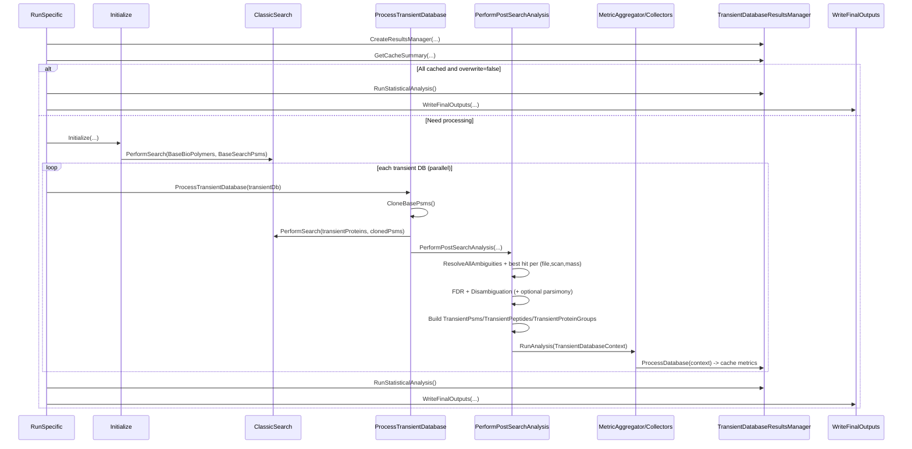

# Baseline-Human Reconciliation: Sequence + Metric Lineage

Companion to `BASELINE_HUMAN_RECONCILIATION_TRUTH_MAP.md`.

## 1) Compact Sequence Diagram

## 2) One-Page Metric Lineage

```mermaid
flowchart LR
    A[Persistent DBs] --> B[Baseline search once\nBaseSearchPsms]
    C[Transient DB i] --> D[Transient proteins + accession set]
    B --> E[CloneBasePsms\nreset FDR fields]
    D --> F[Search transient proteins only\nAddOrReplace on cloned candidates]
    E --> F

    F --> G[Post-search normalize\nResolve ambiguities\nBest per file/scan/mass\nFDR + Disambiguation]
    G --> H[AllPsms + AllPeptides]
    G --> I[FilterToTransientDatabaseOnly\nTransientPsms + TransientPeptides]
    G --> J[Optional parsimony\nProteinGroups + TransientProteinGroups]

    H --> K[BasicMetricCollector\nGlobal confident targets]
    I --> K
    D --> K

    H --> L[PsmPeptideSearchCollector\nAmbiguous vs unambiguous\nvs Homo sapiens]
    I --> L

    J --> M[ProteinGroupCollector\nAmbiguous vs unambiguous\nvs Homo sapiens]

    K --> N[TransientDatabaseMetrics.Results]
    L --> N
    M --> N

    N --> O[TestCollection.BaseTests]
    O --> P[Per-test p-values]
    P --> Q[BH q-values by TestName+MetricName]
    Q --> R[Per-DB StatisticalTestsPassed/Run]
    R --> S[Cutoff: StatisticalTestCount * TestRatioForWriting]
    S --> T[Significant DBs -> combined FASTA + optional follow-up search]
```

## 3) Reconciliation Metric Families (Quick Index)

- **Global confidence baseline**: `TargetPsmsAtQValueThreshold`, `TargetPeptidesAtQValueThreshold`.
- **Transient-attributed evidence**: `TargetPsmsFromTransientDb*`, `TargetPeptidesFromTransientDb*`.
- **Organism ambiguity split**: `PsmBacterial*`, `PeptideBacterial*`, optional `ProteinGroupBacterial*`.
- **Key enrichment inputs**: unambiguous counts and size-normalized rates (`/TransientPeptideCount`, `/TransientProteinCount`).
- **Decision summary**: `StatisticalTestsRun`, `StatisticalTestsPassed`, `TestPassedRatio`.

## 4) Anchor Points (Code)

- Orchestration and filtering: `TaskLayer/ParallelSearch/ParallelSearchTask.cs`.
- Collector execution: `TaskLayer/ParallelSearch/Analysis/MetricAggregator.cs`.
- Metric schema/dictionary mapping: `TaskLayer/ParallelSearch/Analysis/TransientDatabaseMetrics.cs`.
- Ambiguity logic: `TaskLayer/ParallelSearch/Analysis/Collectors/PsmPeptideSearchCollector.cs`, `TaskLayer/ParallelSearch/Analysis/Collectors/ProteinGroupCollector.cs`.
- Statistical finalization and pass ratios: `TaskLayer/ParallelSearch/TransientDatabaseResultsManager.cs`.
- Test wiring: `TaskLayer/ParallelSearch/Statistics/TestCollection.cs`.
