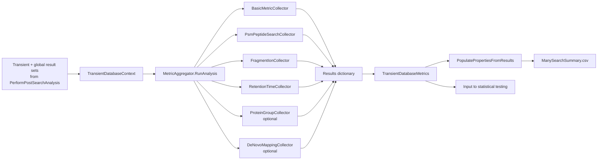

# Post-Search Analysis Metrics and Collectors

This page documents the metric collection layer that sits between transient-database result generation and cross-database statistical testing. It explains the handoff object, the collector pipeline, the typed metric cache representation, and the intent of each collector that feeds `TransientDatabaseMetrics`.

## Key Files

- [`../ParallelSearchTask.cs`](../ParallelSearchTask.cs)
- [`../TransientDatabaseResultsManager.cs`](../TransientDatabaseResultsManager.cs)
- [`../Analysis/TransientDatabaseContext.cs`](../Analysis/TransientDatabaseContext.cs)
- [`../Analysis/MetricAggregator.cs`](../Analysis/MetricAggregator.cs)
- [`../Analysis/TransientDatabaseMetrics.cs`](../Analysis/TransientDatabaseMetrics.cs)
- [`../Analysis/Collectors/BasicMetricCollector.cs`](../Analysis/Collectors/BasicMetricCollector.cs)
- [`../Analysis/Collectors/PsmPeptideSearchCollector.cs`](../Analysis/Collectors/PsmPeptideSearchCollector.cs)
- [`../Analysis/Collectors/ProteinGroupCollector.cs`](../Analysis/Collectors/ProteinGroupCollector.cs)
- [`../Analysis/Collectors/FragmentIonCollector.cs`](../Analysis/Collectors/FragmentIonCollector.cs)
- [`../Analysis/Collectors/RetentionTimeCollector.cs`](../Analysis/Collectors/RetentionTimeCollector.cs)
- [`../Analysis/Collectors/DeNovoMappingCollector.cs`](../Analysis/Collectors/DeNovoMappingCollector.cs)

## Scope

- This page covers the per-database metric collection phase of post-search analysis.
- It starts after `ParallelSearchTask.PerformPostSearchAnalysis(...)` has already built transient and global result sets.
- It stops before `TransientDatabaseResultsManager.RunStatisticalAnalysis()` begins cross-database hypothesis testing.

## Metric Collection Flow

1. `ParallelSearchTask.CreateResultsManager(...)` builds a collector list.
2. `ParallelSearchTask.PerformPostSearchAnalysis(...)` creates a `TransientDatabaseContext` for one transient database.
3. `TransientDatabaseResultsManager.ProcessDatabase(...)` passes that context into `MetricAggregator.RunAnalysis(...)`.
4. `MetricAggregator` runs each `IMetricCollector` in order.
5. Each collector returns a `Dictionary<string, object>` of metric keys and values.
6. `MetricAggregator` merges those values into `TransientDatabaseMetrics.Results`.
7. `TransientDatabaseMetrics.PopulatePropertiesFromResults()` copies the dynamic dictionary into typed properties for CSV serialization and later statistical access.
8. `ParallelSearchResultCache.AddAndWrite(...)` caches the result in `ManySearchSummary.csv`.

Intent: normalize all downstream analysis around one uniform, cached metric object per transient database.

Intent: show how one per-database context fans out into collector-specific metrics and then converges into one cached result object.

## Handoff Object: `TransientDatabaseContext`

### Purpose

- Carry all per-database post-search state needed by collectors.

### Inputs

- transient database identity:
  - `DatabaseName`
  - `TransientDatabase`
  - `TransientProteins`
  - `TransientProteinAccessions`
- search results:
  - `AllPsms`
  - `TransientPsms`
  - `AllPeptides`
  - `TransientPeptides`
- optional parsimony outputs:
  - `ProteinGroups`
  - `TransientProteinGroups`
- shared metadata:
  - `CommonParameters`
  - `TotalProteins`
  - `TransientPeptideCount`
  - `OutputFolder`
  - `NestedIds`

### Outputs

- not written directly; consumed by collectors.

### Intent

- give all collectors a stable, read-only view of one transient database without exposing the rest of `ParallelSearchTask` internals.

### Notes

- `ProteinGroups` and `TransientProteinGroups` are nullable because parsimony is optional.
- `TransientPeptideCount` is passed in explicitly because several downstream metrics normalize against it.

## Aggregation Layer: `MetricAggregator`

### Purpose

- Run a fixed collector list and merge all returned metrics into one `TransientDatabaseMetrics` result.

### Inputs

- a `TransientDatabaseContext`
- the configured `_collectors` list built by `ParallelSearchTask.CreateResultsManager(...)`

### Outputs

- one `TransientDatabaseMetrics` object per database

### Intent

- decouple metric calculation from task orchestration so collectors can evolve independently.

### Notes

- collectors are skipped when `collector.CanCollectData(context)` returns `false`.
- collector exceptions are captured into `TransientDatabaseMetrics.Errors` and do not stop the rest of the pipeline.
- aggregation ends with `PopulatePropertiesFromResults()` so the dynamic and typed views stay synchronized.

## Metric Storage: `TransientDatabaseMetrics`

### Purpose

- serve as the canonical cached result for one transient database.

### Inputs

- dynamic metric key-value pairs merged by `MetricAggregator`

### Outputs

- typed properties used by:
  - `ManySearchSummary.csv`
  - statistical tests in `TestSuiteBuilder`
  - final pass counters such as `StatisticalTestsPassed`

### Intent

- support both flexible collector output and stable CSV serialization.

### Notes

- `Results` is the dynamic in-memory metric dictionary.
- typed properties are the persisted and test-facing representation.
- `PopulatePropertiesFromResults()` maps dictionary keys into typed properties before serialization.
- `PopulateResultsFromProperties()` rebuilds the dictionary after CSV deserialization.
- this dual representation is the bridge between collector extensibility and cache stability.

## Metric Families In `TransientDatabaseMetrics`

### Core Metrics

- total proteins and transient database size
- target PSM and peptide counts
- confident transient PSM and peptide counts
- optional confident protein-group counts
- final statistical pass counters:
  - `StatisticalTestsPassed`
  - `StatisticalTestsRun`
  - `TestPassedRatio`

Intent: provide the baseline counts used by summary output and several enrichment tests.

### Organism Specificity Metrics

- global target and decoy counts
- transient target and decoy counts
- ambiguous vs unambiguous transient evidence
- transient target and decoy score arrays
- optional protein-group analogs

Intent: distinguish host-overlapping evidence from transient-only evidence.

### Fragmentation Metrics

- PSM and peptide medians for:
  - bidirectional ion-series coverage
  - complementary ion counts
  - sequence coverage fraction
- full target and decoy arrays for the same features

Intent: expose both summary-level and distribution-level fragment evidence for downstream tests.

### Retention Time Metrics

- mean absolute RT error for PSMs and peptides
- full RT error arrays for PSMs and peptides

Intent: quantify chromatographic plausibility at both summary and distribution levels.

### De Novo Mapping Metrics

- prediction counts
- target and decoy prediction counts
- unique mapped peptides and proteins
- RT error arrays
- score arrays and score summaries

Intent: add external orthogonal support when de novo mapping data is available.

## Collector Configuration In `ParallelSearchTask.CreateResultsManager(...)`

The collector list is assembled in a fixed order:

1. `BasicMetricCollector`
2. `PsmPeptideSearchCollector("Homo sapiens")`
3. `FragmentIonCollector`
4. `RetentionTimeCollector`
5. `ProteinGroupCollector("Homo sapiens")` when parsimony is enabled
6. `DeNovoMappingCollector(...)` when a de novo mapping file is configured

Intent: always produce the core metrics first, then add optional evidence layers only when the required inputs exist.

## Collector Details

### `BasicMetricCollector`

- Purpose: compute the always-present count metrics for proteins, PSMs, and peptides.
- Inputs:
  - `context.TotalProteins`
  - `context.TransientProteinAccessions`
  - `context.TransientPeptideCount`
  - `context.AllPsms`
  - `context.TransientPsms`
  - `context.AllPeptides`
  - `context.TransientPeptides`
  - `context.CommonParameters`
- Outputs:
  - `TotalProteins`
  - `TransientProteinCount`
  - `TransientPeptideCount`
  - `TargetPsmsAtQValueThreshold`
  - `TargetPsmsFromTransientDb`
  - `TargetPsmsFromTransientDbAtQValueThreshold`
  - `TargetPeptidesAtQValueThreshold`
  - `TargetPeptidesFromTransientDb`
  - `TargetPeptidesFromTransientDbAtQValueThreshold`
- Intent: establish the primary yield and confidence counts used throughout the rest of the analysis.
- Notes:
  - uses `Math.Min(QValueThreshold, PepQValueThreshold)` as the effective confidence cutoff.
  - `CanCollectData(...)` requires all PSM and peptide lists to be present.

### `PsmPeptideSearchCollector`

- Purpose: compute organism-specific ambiguity and score metrics for PSMs and peptides.
- Inputs:
  - `context.AllPsms`
  - `context.TransientPsms`
  - `context.AllPeptides`
  - `context.TransientPeptides`
  - `context.CommonParameters`
  - target organism string supplied in the constructor, currently `"Homo sapiens"`
- Outputs:
  - global target and decoy counts:
    - `PsmTargets`, `PsmDecoys`
    - `PeptideTargets`, `PeptideDecoys`
  - transient target and decoy counts:
    - `PsmBacterialTargets`, `PsmBacterialDecoys`
    - `PeptideBacterialTargets`, `PeptideBacterialDecoys`
  - transient ambiguity counts:
    - `PsmBacterialAmbiguous`, `PsmBacterialUnambiguousTargets`, `PsmBacterialUnambiguousDecoys`
    - `PeptideBacterialAmbiguous`, `PeptideBacterialUnambiguousTargets`, `PeptideBacterialUnambiguousDecoys`
  - transient score arrays:
    - `PsmBacterialUnambiguousTargetScores`, `PsmBacterialUnambiguousDecoyScores`
    - `PeptideBacterialUnambiguousTargetScores`, `PeptideBacterialUnambiguousDecoyScores`
- Intent: separate transient-only evidence from host-overlapping evidence and preserve score distributions for later testing.
- Notes:
  - a match is treated as organism-ambiguous when any best-matching bio-polymer contains the configured target organism string.
  - only confident matches at the effective q-value threshold are included.

### `ProteinGroupCollector`

- Purpose: collect protein-group analogs of the organism-specific and confident-count metrics.
- Inputs:
  - `context.ProteinGroups`
  - `context.TransientProteinGroups`
  - `context.CommonParameters`
  - target organism string supplied in the constructor, currently `"Homo sapiens"`
- Outputs:
  - `ProteinGroupTargets`
  - `ProteinGroupDecoys`
  - `TargetProteinGroupsAtQValueThreshold`
  - `TargetProteinGroupsFromTransientDb`
  - `TargetProteinGroupsFromTransientDbAtQValueThreshold`
  - `ProteinGroupBacterialTargets`
  - `ProteinGroupBacterialDecoys`
  - `ProteinGroupBacterialUnambiguousTargets`
  - `ProteinGroupBacterialUnambiguousDecoys`
- Intent: capture whether transient evidence survives the protein inference layer.
- Notes:
  - `CanCollectData(...)` requires both protein-group lists.
  - `AnalyzeProteinGroups(...)` ignores groups with `QValue > threshold`.
  - `AnalyzeProteinGroups(...)` also requires `pg.AllPeptides.Count >= 2`.

### `FragmentIonCollector`

- Purpose: compute fragment-evidence quality metrics for confident transient PSMs and peptides.
- Inputs:
  - `context.TransientPsms`
  - `context.TransientPeptides`
  - `context.CommonParameters`
  - spectral-match fragment coverage helpers such as `GetAminoAcidCoverage()` and `SpectralMatch.GetLongestIonSeriesBidirectional(...)`
- Outputs:
  - target and decoy medians for PSMs and peptides:
    - bidirectional ion-series coverage
    - complementary ion counts
    - sequence coverage fractions
  - full target and decoy arrays for the same features
- Intent: preserve both summary and distribution views of fragment support for later statistical testing.
- Notes:
  - uses only confident transient PSMs and peptides.
  - normalizes bidirectional and complementary counts by peptide length.
  - sequence coverage falls back to `0` when `FragmentCoveragePositionInPeptide` is missing.

### `RetentionTimeCollector`

- Purpose: compute RT agreement metrics between observed scans and predicted peptide RTs.
- Inputs:
  - `context.TransientPsms`
  - `context.TransientPeptides`
  - `context.CommonParameters`
  - `ChronologerRetentionTimePredictor`
- Outputs:
  - `PsmMeanAbsoluteRtError`
  - `PsmAllRtErrors`
  - `PeptideMeanAbsoluteRtError`
  - `PeptideAllRtErrors`
  - correlation coefficients are also emitted by the collector, although the current typed cache class only surfaces the mean absolute errors and full error arrays
- Intent: expose chromatographic plausibility metrics for both summary tests and distribution tests.
- Notes:
  - only the first non-decoy hypothesis is used per match.
  - predictions are cached by full sequence inside the collector.
  - invalid or missing predictions are skipped.
  - insufficient data returns `double.NaN` instead of `0`.
  - `CanCollectData(...)` requires peptide-style spectral matches.

### `DeNovoMappingCollector`

- Purpose: inject externally computed de novo mapping metrics for the current database.
- Inputs:
  - `context.DatabaseName`
  - the `DeNovoMappingResultFile` identified by the constructor file path
- Outputs:
  - `DeNovo_TotalPredictions`
  - `DeNovo_TargetPredictions`
  - `DeNovo_DecoyPredictions`
  - `DeNovo_UniquePeptidesMapped`
  - `DeNovo_UniqueProteinsMapped`
  - `DeNovo_MeanRtError`
  - `DeNovo_RetentionTimeErrors`
  - `DeNovo_MeanPredictionScore`
  - `DeNovo_PredictionScores`
  - `DeNovo_TargetPredictionScores`
  - `DeNovo_DecoyPredictionScores`
- Intent: extend the post-search metric space with orthogonal evidence that was generated outside the main search pipeline.
- Notes:
  - data is lazy-loaded and cached by `DatabaseIdentifier`.
  - `CanCollectData(...)` only checks whether the database name exists in the de novo result cache.

## Cache And Output Behavior

### `TransientDatabaseResultsManager.ProcessDatabase(...)`

- Purpose: compute or reuse one cached `TransientDatabaseMetrics` result per transient database.
- Inputs:
  - `TransientDatabaseContext`
  - `forceRecompute`
- Outputs:
  - cached or newly generated `TransientDatabaseMetrics`
- Intent: make metric collection restartable and reuse results across repeated runs.
- Notes:
  - cached results are returned immediately unless `forceRecompute` is set.
  - new results are written into `ManySearchSummary.csv` through `ParallelSearchResultCache.AddAndWrite(...)`.

### `ManySearchSummary.csv`

- Purpose: persist the typed metric view of each transient database.
- Produced by:
  - `ParallelSearchResultCache.WriteAllToFile(...)`
  - `TransientDatabaseResultsManager.WriteAllResults(...)`
- Contents relevant to this page:
  - core count metrics
  - organism-specific metrics
  - fragment metrics
  - RT metrics
  - de novo metrics when present
  - final statistical pass counters after later finalization
- Intent: act as both the durable cache and the main per-database summary table.

## Known Caveats / Open Questions

- `TransientDatabaseMetrics` is deliberately dual-represented. Any new collector output that is meant to survive caching must be mapped in both `PopulatePropertiesFromResults()` and `PopulateResultsFromProperties()`.
- `RetentionTimeCollector` emits correlation coefficients, but the current typed `TransientDatabaseMetrics` surface only includes the mean absolute errors and full error arrays.
- Host ambiguity is currently defined by string containment against `"Homo sapiens"` in `PsmPeptideSearchCollector` and `ProteinGroupCollector`. That is convenient, but it bakes an organism-specific assumption into the metric layer.
- `FragmentIonCollector` and `RetentionTimeCollector` rely only on confident transient evidence. That keeps the metrics focused, but it means low-yield databases can produce sparse arrays or `NaN` summary values.
- Optional collectors are coupled to upstream pipeline choices such as parsimony and de novo mapping availability, so the exact metric surface can change between runs.

## Related Pages

- [Parallel Search Wiki](README.md)
- [Post-Search Analysis Statistical Testing](PostSearchAnalysis-StatisticalTesting.md)
