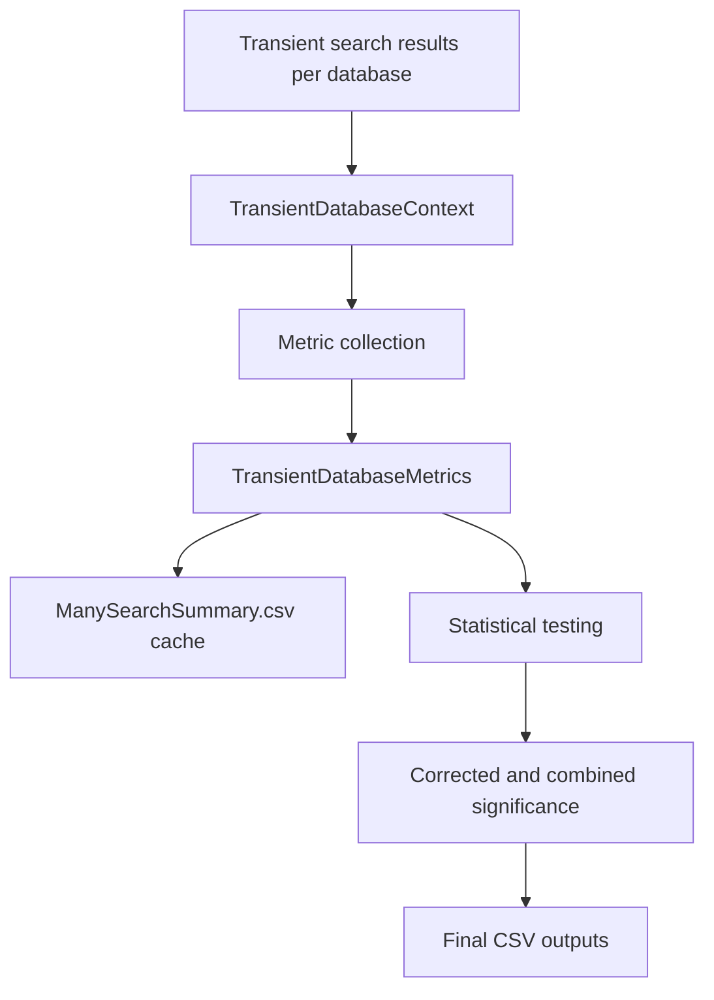

# Parallel Search Wiki

This wiki documents the developer-facing structure of `TaskLayer/ParallelSearch`. The first page set focuses on post-search analysis: how per-database metrics are collected, how those metrics feed statistical tests, how cross-database significance is finalized, and which files are written.

## Scope

- This wiki currently covers the post-search analysis layer.
- It starts after transient search results have been materialized for one database and follows the flow through metric collection, statistical testing, and aggregate outputs.
- It does not yet document the full search execution path, baseline search initialization, or database-writing decisions in detail.

## Key Files

- [`../ParallelSearchTask.cs`](../ParallelSearchTask.cs)
- [`../TransientDatabaseResultsManager.cs`](../TransientDatabaseResultsManager.cs)
- [`../Statistics/Suite/TestSuiteBuilder.cs`](../Statistics/Suite/TestSuiteBuilder.cs)
- [`../Statistics/Abstractions/StatisticalTestBase.cs`](../Statistics/Abstractions/StatisticalTestBase.cs)
- [`../Statistics/Results/StatisticalTestResult.cs`](../Statistics/Results/StatisticalTestResult.cs)
- [`../Statistics/Correction/MetaAnalysis.cs`](../Statistics/Correction/MetaAnalysis.cs)
- [`../Statistics/Calibration/CalibrationService.cs`](../Statistics/Calibration/CalibrationService.cs)
- [`../Statistics/IsolationForest/AnomalyDetectionService.cs`](../Statistics/IsolationForest/AnomalyDetectionService.cs)
- [`../IO/StatisticalTestResultFile.cs`](../IO/StatisticalTestResultFile.cs)

## Terminology

- `Transient database`: the candidate organism database currently being evaluated against the shared baseline search context.
- `Metric`: a value stored on `TransientDatabaseMetrics` and consumed by one or more statistical tests.
- `Test family`: a grouped set of `IStatisticalTest` instances assembled in `TestSuiteBuilder`.
- `Combined result`: the synthetic `Combined | All` statistical result created after individual tests have run.

## Pages

- [Post-Search Analysis Metrics and Collectors](PostSearchAnalysis-MetricsAndCollectors.md)
- [Post-Search Analysis Statistical Testing](PostSearchAnalysis-StatisticalTesting.md)
- [Statistical Framework Theory and Refactor Plan](StatisticalFramework-TheoryAndRefactorPlan.md)

## Information Flow

Intent: show the boundary between per-database metric collection and cross-database statistical finalization.

## Related Pages

- [Post-Search Analysis Metrics and Collectors](PostSearchAnalysis-MetricsAndCollectors.md)
- [Post-Search Analysis Statistical Testing](PostSearchAnalysis-StatisticalTesting.md)
- [Statistical Framework Theory and Refactor Plan](StatisticalFramework-TheoryAndRefactorPlan.md)
